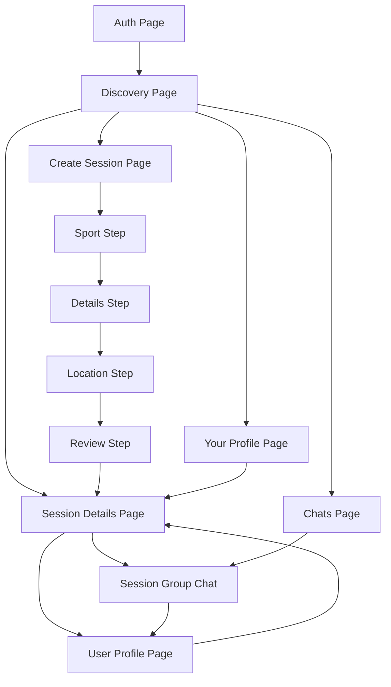

# Bubbleverse Final Concept

## Purpose

Bubbleverse is a mobile-first sports meetup app for young expats and international students who want to find nearby sports sessions without the usual uncertainty of dead group chats, unclear turnout, or vague logistics.

The core promise is simple: open the app, see real sessions on a map, understand who is going, and join something nearby with enough context to decide quickly.

This document is the single source of truth for the app concept represented by the current codebase. Where older docs or placeholder files disagree, this document wins.

## Audience

Primary audience:
- Young expats
- International students
- Recently arrived people building a local social routine through sport
- Casual players who want low-friction sessions more than formal club membership

Audience traits implied by the product:
- They may not already have a sports network
- They want lightweight trust signals before showing up
- They care about proximity, timing, and who will actually come
- They are comfortable with English as the default product language
- They may speak multiple languages and appreciate visible profile context

## Problem

The app solves a local coordination problem:
- People want to play sports nearby
- Existing coordination channels are noisy, fragmented, or inactive
- It is hard to tell whether a session is real, suitable, and likely to happen
- Joining can feel socially risky when the format, host, or turnout is unclear

Bubbleverse reduces that friction by making the decision visible upfront:
- What sport it is
- Where it is
- When it starts
- What it costs
- What level it is
- Who is hosting
- How many people are interested, on the way, or already there

## Product Positioning

Bubbleverse is not a club-management tool and not a full social network.

It is:
- A nearby session discovery app
- A lightweight coordination layer for casual sports meetups
- A trust-aware, map-first way to join local activity quickly

It is not:
- A booking marketplace
- A tournament platform
- A team management suite
- A real-time safety platform with live moderation
- A production backend product yet

## Core Product Promise

Users should be able to:
1. Discover sports sessions around them in under a minute.
2. Judge whether a session feels worth joining before entering chat.
3. Create a session with clear details and clear expectations.
4. Coordinate with attendees through a simple per-session group chat.
5. Assess hosts and participants through lightweight trust and profile signals.

The emotional promise is:
- Less guesswork
- Less social friction
- Less chaos
- More confidence to show up

## Product Principles

### 1. Map First

Discovery starts with place, not with long feeds.

The map is the main home screen because nearby relevance matters more than endless browsing.

### 2. Transparency Before Commitment

Users should see timing, turnout, cost, skill level, and host context before they need to join chat or attend.

### 3. Lightweight Coordination

The product favors simple coordination states over heavy planning tools. Attendance uses:
- `Interested`
- `On my way`
- `Here`

This is intentional. The app optimizes for informal real-world meetups, not formal RSVPs.

### 4. Low Pressure Social Discovery

Profiles, interests, languages, and visible host context help users gauge whether a session feels welcoming without overcomplicating identity or onboarding.

### 5. Safety by Clarity

The current product does not provide full operational safety systems. Instead, it improves perceived safety through:
- Clear session details
- Visible host identity
- Women-only session support
- Blocking and reporting
- Limited, text-only chat

## Current App Scope

The current codebase supports the following flows.

### Authentication and Entry

Route: `/auth`

Users can:
- Enter with a demo profile
- Create a lightweight profile using a display name
- Pick interests
- Toggle nearby discovery

The onboarding message should feel fast, welcoming, and low-pressure. Identity is intentionally lightweight in this version.

### Discovery

Route: `/discover`

This is the product hub.

Users can:
- View nearby sessions on a map
- Filter by sport category
- Filter by cost
- Filter by skill level
- Filter for women-only sessions
- Sort by closest or soonest
- Tap a pin or card to inspect a session
- Jump to chats
- Jump to their own profile

Discovery should answer: "What can I join near me right now or soon?"

### Session Creation

Route: `/create`

Creation is a 4-step wizard:
1. Sport
2. Details
3. Location
4. Review

Hosts define:
- Sport category
- Title
- Description
- Start time
- Duration
- Price
- Skill level
- Women-only status
- Required equipment
- Extra facilities
- Exact map pin and location label

Creation should encourage hosts to remove ambiguity, not to write long event descriptions.

### Session Detail

Route: `/event/:eventId`

This page is where trust is earned before chat.

Users can review:
- Session overview
- Player count
- Time window
- Women-only status if applicable
- Equipment and facilities
- People attending
- Host trust indicators
- Location and safety note
- Reminder toggle
- Attendance status
- Entry into chat
- Reporting and blocking actions

The detail page should answer: "Do I trust this enough to join?"

### Chats

Routes:
- `/chats`
- `/chat/:eventId`

Chat is scoped to a session, not to private DMs.

Users can:
- See the list of session chats they are part of
- Enter a group chat for a specific session
- Send text messages
- View simple moderation states
- Report problematic messages

Chat exists to coordinate the real-world meetup, not to become a full messaging product.

### Profiles

Routes:
- `/profile/me`
- `/profile/:userId`

Profiles serve two jobs:
- Let users manage how they appear
- Let others evaluate whether they want to join a session with that person

Profile capabilities include:
- Editing display name, bio, interests, languages, and nearby discovery
- Viewing hosted and joined sessions
- Adding or removing friends
- Reporting a user
- Blocking a user
- Exporting current user data
- Deleting the current account
- Signing out

## Core Data Model

### User

A user has:
- Display name
- Bio
- Interests
- Languages
- Nearby discovery preference
- Avatar preset
- Friends
- Trust flags

Trust flags currently include:
- Verified host
- No-show strikes
- Report count
- Blocked user IDs

### Event

A session event has:
- Host
- Sport category
- Title and description
- Venue label and coordinates
- Start time
- Duration
- Price
- Skill level
- Women-only flag
- Equipment needs
- Facilities
- Attendees
- Attendance statuses
- Reminder subscriptions
- A linked chat
- An optional safety note

### Message

A message belongs to a session chat and includes:
- Sender
- Text
- Timestamp
- Demo moderation state

### Report

Users can report:
- A user
- An event
- A message

## Trust and Safety Philosophy

Bubbleverse currently presents trust and safety as a lightweight product layer, not a fully operational backend system.

The app supports:
- Visible host context
- Verified-host badges in mock form
- No-show strike visibility
- Report counts
- Blocking
- Reporting
- Demo message moderation states
- Women-only session visibility and filtering

Important product truth:
- These are demo mechanics and interface signals
- They help shape user trust
- They do not represent a real moderation or enforcement stack yet

## Social Rules Implied by the Product

The codebase implies a community with the following norms:
- Use a visible display name
- Be clear about your sport level and session format
- Keep logistics visible before people commit
- Respect eligibility boundaries such as women-only sessions
- Use chat for coordination, not for content-heavy social posting
- Signal attendance honestly
- Report or block when something feels unsafe or misleading

## Geographic and Cultural Context

The current demo data is clustered around TU Delft in the Netherlands.

That means the present product feel is:
- Urban or campus-adjacent
- Walkable or bikeable distances
- International and English-friendly
- Socially casual rather than institutionally formal

For concept purposes, Bubbleverse should be framed as:
"A local sports discovery app for expats and internationals in a city area, with the current prototype demonstrated through a Delft/campus-like environment."

This keeps the audience positioning accurate without pretending the app is only for one campus.

## Supported Sports in the Current Product

Current event categories:
- Tennis
- Padel
- Football
- Basketball
- Running
- Training

Profiles can express broader interests than the live event taxonomy. That is acceptable in the current concept: identity can be broader than available session supply.

## Design and Brand Direction

Bubbleverse should feel:
- Friendly
- Youthful
- Slightly playful
- Trust-building
- Clear rather than corporate

Current visual direction:
- Mobile-first phone-frame presentation
- Glassy, layered surfaces
- Bold serif headlines with clean sans-serif body text
- Green primary actions
- Soft purple accents
- Emoji-led sport identity
- Warm, social, optimistic copy

The brand should feel like:
"real people meeting up for sports nearby,"
not
"enterprise scheduling software" or "serious athletic performance software."

## Product Language

The product voice should remain:
- Short
- clear
- warm
- lightly confident
- honest about limitations

Preferred tone examples:
- "Join session & open chat"
- "Tune the session feed"
- "See who is coming"
- "Keep eligibility explicit on the session card"

The app should continue to avoid formal or bureaucratic language unless discussing data export, deletion, or safety actions.

## Current Technical Reality

This concept is implemented today as:
- Frontend only
- Mock data seeded on first load
- Local persistence through `localStorage`
- No real authentication
- No real backend
- No live geolocation service
- No payments
- No calls
- No image upload
- No private direct messaging

This must be treated as part of the concept, not hidden from it. The product is a prototype proving the interaction model, trust model, and audience fit.

## Non-Goals for the Current Version

Bubbleverse v1 does not aim to solve:
- Formal club administration
- League scheduling
- Advanced moderation operations
- Background identity verification
- Rich media messaging
- Full booking and payment workflows
- Hyper-precise attendance guarantees
- Large desktop-first workflows

## Canonical Navigation

These are the canonical app routes for the current concept:
- `/auth`
- `/discover`
- `/create`
- `/event/:eventId`
- `/chats`
- `/chat/:eventId`
- `/profile/me`
- `/profile/:userId`

If other docs omit `/chats` or `/profile/me`, this document is the correct reference.

## Information Architecture

## Success Criteria

The concept is working if a new user can:
1. Enter the app in seconds.
2. Understand what nearby sessions exist immediately.
3. Decide whether a session is a fit from the detail page.
4. Join and coordinate without confusion.
5. Feel enough trust to show up in person.

The host side is working if someone can:
1. Create a clear session quickly.
2. Signal the important logistics upfront.
3. Attract the right level of participants.
4. Use chat only for lightweight coordination after the session page has done the heavy lifting.

## Final Product Statement

Bubbleverse is a mobile-first sports discovery and coordination app for young expats and international newcomers who want to join nearby casual sports sessions with less guesswork. It combines map-based discovery, visible turnout signals, lightweight host trust cues, and simple per-session chat so users can decide fast, feel safer, and show up with confidence.
