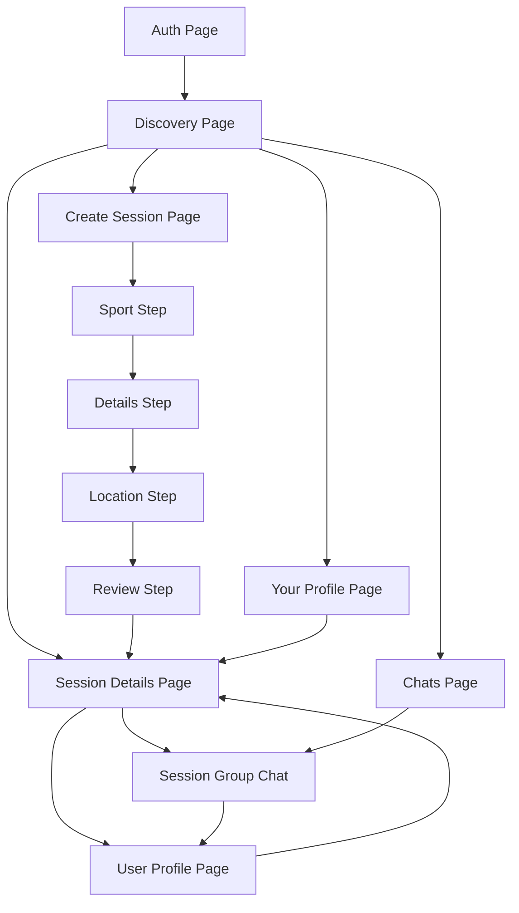

# Bubbleverse Information Architecture

This document only covers the app's page hierarchy and how pages connect to each other.

## Pages

- Auth Page
- Discovery Page
- Create Session Page
- Create Session: Sport Step
- Create Session: Details Step
- Create Session: Location Step
- Create Session: Review Step
- Session Details Page
- Chats Page
- Session Group Chat
- Your Profile Page
- User Profile Page

## Mermaid Graph

## Hierarchy Notes

- Auth Page leads into the main app experience.
- Discovery Page is the central hub of the product.
- Create Session Page, Session Details Page, Chats Page, and Your Profile Page branch from Discovery Page.
- Create Session Page is a multi-step flow with four internal pages: Sport, Details, Location, and Review.
- Session Group Chat is accessed from session-related contexts.
- User Profile Page is reached from session and chat contexts.
- Session Details Page acts as the main bridge between discovery, chat, and participant profiles.
